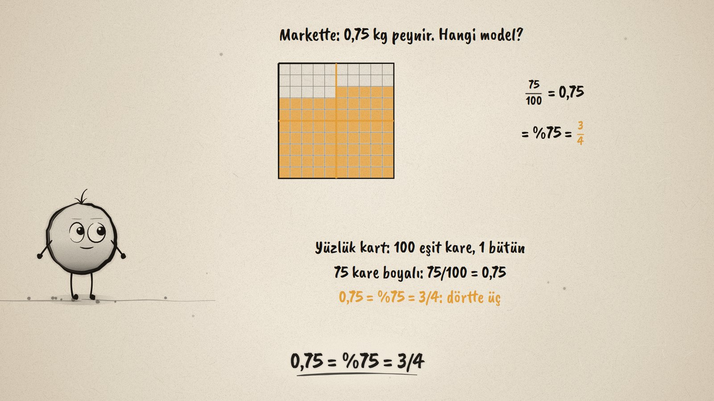
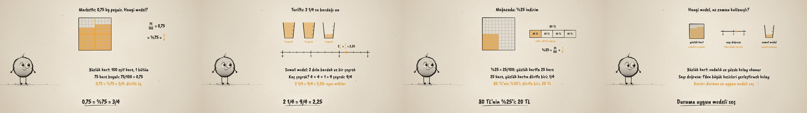

# Bir Kesir, Dört Kılık · One Fraction, Many Forms

**▶ Tarayıcıda izleyin / Watch in the browser:** https://hakanatas.github.io/bir-kesir-dort-kilik/ 
**⬇ MP4 + altyazılar / MP4 + subtitles:** [Releases](https://github.com/hakanatas/bir-kesir-dort-kilik/releases) 
**✎ Kullanılan istem / The prompt behind it:** [PROMPT.md](PROMPT.md) 
**🎞 Bütün filmler / All films:** [Nokta'nın Filmleri](https://hakanatas.github.io/nokta-filmleri/?sinif=5)

> **TR —** 5. sınıf matematik "Sayılar ve Nicelikler" temasındaki MAT.5.1.3 öğrenme çıktısı için hazırlanmış, tamamen JavaScript ile çizilen 92 saniyelik mürekkep animasyonu. Kesirler hayatta farklı kılıklarda karşımıza çıkıyor: tarifte 2 1/4 bardak un (tam sayılı), markette 0,75 kg peynir (ondalık), kampanyada %25 indirim (yüzde), şişede 5/4 litre süt (bileşik). 0,75 kg yüzlük kartta 75 kare: 75/100 = 0,75 = %75 = 3/4. 2 1/4 bardak un somut modelle (2 dolu bardak ve bir çeyrek, toplam 9 çeyrek) ve sayı doğrusunda gösteriliyor: 2 1/4 = 9/4 = 2,25. %25 yüzlük kartta 25 kare, kartın dörtte biri; 80 TL'nin %25'i 20 TL. Son olarak modeller kullanışlılık açısından karşılaştırılıyor: yüzlük kart ondalık ve yüzde için, sayı doğrusu 1'den büyük kesirler için, somut model günlük durumlar için; duruma uygun model seçiliyor. Altyazılar Türkçe, İngilizce ya da ikisi birlikte seçilebilir.

A 92-second ink animation for **5th-grade maths**. Nokta, the ink character from [The Learning Ink](https://github.com/hakanatas/the-learning-ink), is the guide again. The same hundred grid (`grid` in `scenes/scene1.js`) shades 0.75 row by row and 25% as a 5 × 5 corner, so the quarter lines drawn over it show 3/4 and 1/4 directly.

## Learning outcome

MEB, Türkiye Yüzyılı Maarif Modeli, Ortaokul Matematik, 5th grade, "Sayılar ve Nicelikler" theme:

**MAT.5.1.3. Gerçek yaşam durumlarına karşılık gelen kesirleri farklı biçimlerde temsil edebilme**
- a) Kesirlerin farklı gösterimlerinin (bileşik, tam sayılı, ondalık, yüzde) gerçek yaşam durumu içerisindeki kullanımını anlar.
- b) Gerçek yaşam durumlarında karşılaşılan kesirlerin farklı gösterimlerini ilişkilendirmek için farklı modelleri (yüzlük kart, somut modeller, sayı doğrusu gibi) seçer.
- c) Seçilen modelleri kullanır.
- ç) Kullanılan modelleri kesirlerin farklı gösterimleri ile yorumlar.
- d) Benzer durumlarda kullanılabilecek farklı modelleri kullanışlılık açısından karşılaştırır.
- e) Karşılaştırdığı modellerin kullanışlılığına ilişkin karar verir.

## Scenes

| # | Time | Scene | What happens | Outcome |
|---|---|---|---|---|
| 1 | 0–10 s | Hayattaki kesirler | A recipe, a shop, a sale, a bottle: mixed, decimal, percent, improper. | a |
| 2 | 10–28 s | Yüzlük kart | 0.75 kg as 75 of 100 squares: 75/100 = 0.75 = 75% = 3/4. | b, c, ç |
| 3 | 28–46 s | Somut model ve sayı doğrusu | 2 1/4 cups: two full and a quarter, 9 quarters; on the number line 2 1/4 = 9/4 = 2.25. | b, c, ç |
| 4 | 46–64 s | Yüzde | 25% as 25 squares, a quarter of the grid; 25% of 80 TL is 20 TL. | c, ç |
| 5 | 64–80 s | Hangi model? | Grid for decimals and percents, number line for fractions above 1, objects for daily situations. | d, e |
| 6 | 80–92 s | Aklında kalsın | One fraction, many forms; pick the model that fits. | a–e |

## Running it

- **Preview:** double-click `index.html` (it works offline).
- **MP4:** run `npm install` once, then `npm run export -- --format=horizontal --captions=tr`.
- **Subtitles and narration:** `npm run srt` writes `out/captions_*.srt` and `narration_notes.txt`.
- **Editing:**
  - Caption text, timings and narration notes: `captions.js`
  - Everything on screen is drawn by `LI.world(t)` in `scenes/scene1.js` (the cards, the hundred grid, the cups, the number line, the bar, the words); the other scenes only set the camera.
  - Fractions in text and Nokta's poses: `src/draw/film.js`; layout for 16:9 and 9:16: `src/draw/kd.js`

It uses the same engine as The Learning Ink: `renderFrame(t)` as a pure function of time, seeded randomness, and frame-by-frame export.

## Lisans · License

**TR —** Bu film ve kodu [Creative Commons Atıf-GayriTicari 4.0 Uluslararası (CC BY-NC 4.0)](https://creativecommons.org/licenses/by-nc/4.0/deed.tr) lisansıyla paylaşılır. Ticari olmayan her amaçla (derste, okulda, eğitim materyalinde) kopyalayabilir, paylaşabilir ve değiştirebilirsiniz; ancak **kaynak göstermek zorunludur**: eser sahibinin adı ve bu deponun bağlantısı belirtilmeden kullanılamaz. Ticari kullanım (satış, ücretli ürün ya da yayın) için izin alınmalıdır.

**EN —** This film and its code are licensed under [Creative Commons Attribution-NonCommercial 4.0 International (CC BY-NC 4.0)](https://creativecommons.org/licenses/by-nc/4.0/). You may copy, share and adapt them for non-commercial purposes, but **attribution is required**: they may not be used without crediting the author and linking to this repository. Commercial use requires permission.

Atıf örneği / Required credit: *“Bir Kesir, Dört Kılık”, Hakan Ataş, Nokta'nın Filmleri — https://github.com/hakanatas/bir-kesir-dort-kilik — CC BY-NC 4.0*
